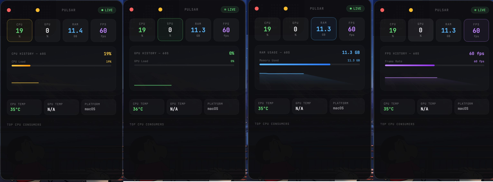

<div align="center">

# 🌟 Pulsar
### A beautiful, lightweight system monitor widget for macOS, Windows, and Linux
> Real-time CPU, GPU, RAM, temperature and top process monitoring — in a sleek floating widget

</div>

---

## ✨ Features

- 🟡 **CPU usage** — live percentage with color indicator
- 🟢 **GPU usage** — real-time monitoring  
- 🔵 **RAM usage** — used vs total in GB
- 🟣 **FPS counter** — frame rate display
- 🌡️ **CPU temperature** — live thermal readout
- 📊 **60 second history graph** — sparkline chart for every metric
- 🏆 **Top CPU consumers** — see which apps are eating your CPU
- 🪟 **Transparent floating widget** — sits cleanly on your desktop
- 🔴 **Close button** — exits the app
- 🟡 **Minimize to tray** — hides widget, keeps running in background
- ⚡ **Lightweight** — built with Rust + Tauri, tiny memory footprint

---

## 📸 Preview



---

## ⬇️ Download and Install

> No coding required. Just download and run.

Go to the [**Releases**](https://github.com/udhavvvv-dev/pulsaar/releases/latest) page and download the file for your OS:

| Platform | File | How to install |
|---|---|---|
| 🍎 **macOS** | `Pulsar_1.0.0_aarch64.dmg` | Double-click → drag to Applications → open |
| 🪟 **Windows** | `Pulsar_1.0.0_x64-setup.exe` | Double-click → follow installer |
| 🐧 **Linux** | `pulsar_1.0.0_amd64.AppImage` | Right-click → Properties → Allow executing as program → double-click |

> **Not sure which file to pick?** Windows → `.exe`, Mac → `.dmg`, Linux → `.AppImage`

---

## 🖥️ System Requirements

| Platform | Minimum |
|---|---|
| macOS | 10.15 Catalina or later |
| Windows | Windows 10 or later |
| Linux | Ubuntu 20.04+ or any distro with WebKit2GTK |

---

## 🛠️ Build From Source

Only needed if you want to modify the code. Otherwise just download above.

### Prerequisites

- [Node.js](https://nodejs.org) LTS
- [Rust](https://rustup.rs)

### Steps

```bash
# Clone the repo
git clone https://github.com/udhavvvv-dev/pulsaar.git
cd pulsaar

# Install dependencies
npm install

# Run in development
npm run tauri dev

# Build for your platform
npm run tauri build
```

---

## 📄 License

MIT — free to use, modify, and share.

---

<div align="center">
Built with ❤️ using Tauri + Rust
</div>
